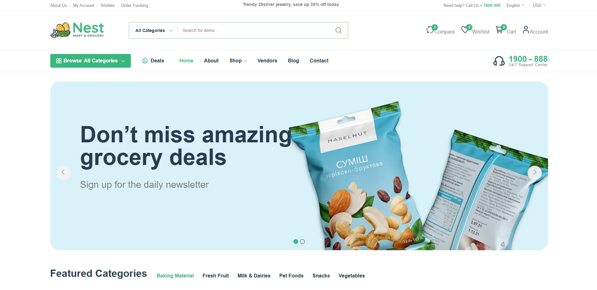

# Nexora — Django E-Commerce

<p align="center">
  A modern multi-vendor e-commerce platform built with Django.
</p>

<p align="center">
  
  
  
  
  
  
  
</p>


## 📖 About

**Nexora** is a Django-based multi-vendor e-commerce platform with customer and vendor functionality, product management, shopping cart, checkout, orders, wishlist, reviews, authentication, and REST APIs.

## ✨ Features

* 🔐 User authentication with JWT and email verification
* 🛍️ Product, category, tag, and stock management
* 🏪 Multi-vendor marketplace
* 🛒 Shopping cart and checkout
* 📦 Order and coupon management
* ❤️ Wishlist and product reviews
* 📊 Customer and vendor dashboards
* 📝 Blog system
* 🔎 Search, filtering, sorting, and pagination
* ⚡ Redis caching and Celery background tasks
* 📚 Swagger / ReDoc API documentation
* 🐳 Docker and Docker Compose
* 🧪 Pytest, Coverage, Flake8, and Black
* 🚀 GitHub Actions CI/CD

## 📸 Screenshots

### Homepage

<p align="center">
  
</p>

### Shop

<p align="center">
  
</p>

### Product Detail

<p align="center">
  
</p>

### Shopping Cart

<p align="center">
  
</p>

### Vendor Dashboard

<p align="center">
  
</p>

### Add Product

<p align="center">
  
</p>

## 🛠️ Tech Stack

| Technology            | Purpose          |
| --------------------- | ---------------- |
| Python 3.11           | Backend          |
| Django 5.2            | Web Framework    |
| Django REST Framework | REST API         |
| SimpleJWT             | Authentication   |
| Redis                 | Cache & Broker   |
| Celery                | Background Tasks |
| SQLite                | Database         |
| Docker                | Containerization |
| Gunicorn              | WSGI Server      |
| Pytest                | Testing          |

## 📁 Project Structure

```text
Nexora/
├── core/
│   ├── accounts/
│   ├── api/
│   ├── blog/
│   ├── cart/
│   ├── dashboard/
│   ├── orders/
│   ├── shop/
│   ├── vendors/
│   ├── website/
│   └── core/
├── .github/
├── docker-compose.yml
├── docker-compose.prod.yml
├── dockerfile
├── requirements.txt
└── LICENSE
```

## 🚀 Installation

```bash
git clone https://github.com/mohamad-karimi/Nexora.git
cd Nexora

python -m venv venv
```

### Windows

```bash
venv\Scripts\activate
```

### Linux / macOS

```bash
source venv/bin/activate
```

Install dependencies:

```bash
pip install -r requirements.txt
cd core
```

Run migrations:

```bash
python manage.py migrate
```

Create admin:

```bash
python manage.py createsuperuser
```

Start the server:

```bash
python manage.py runserver
```

Open:

```text
http://127.0.0.1:8000/
```

## 📚 API Documentation

```text
/api/docs/
/api/redoc/
/api/schema/
```

## 🐳 Docker

```bash
docker compose up --build
```

The Docker environment includes Django, Redis, Celery Worker, and Celery Beat.

## ⚙️ Environment Variables

Create a `.env` file:

```env
SECRET_KEY=your-secret-key
DEBUG=True
ALLOWED_HOSTS=localhost,127.0.0.1
EMAIL_HOST_USER=your-email
EMAIL_HOST_PASSWORD=your-password
REDIS_HOST=localhost
REDIS_PORT=6379
```

Never commit real credentials or secret keys.

## 📄 License

This project is licensed under the **MIT License**.

## 👨‍💻 Author

**Mohamad Karimi**

GitHub:
https://github.com/mohamad-karimi/Nexora
